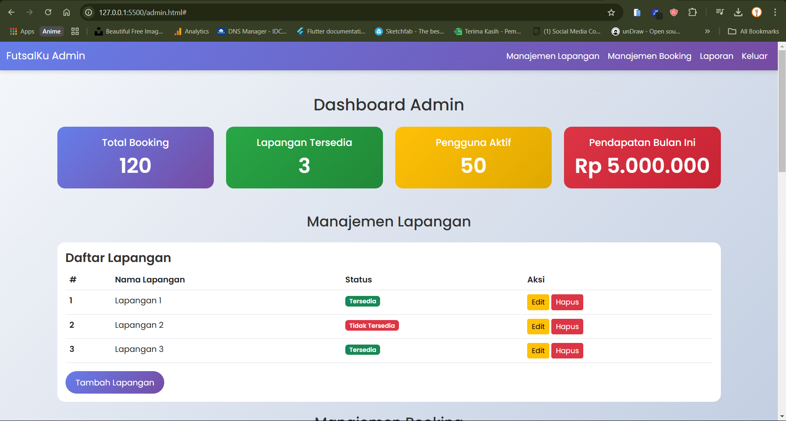
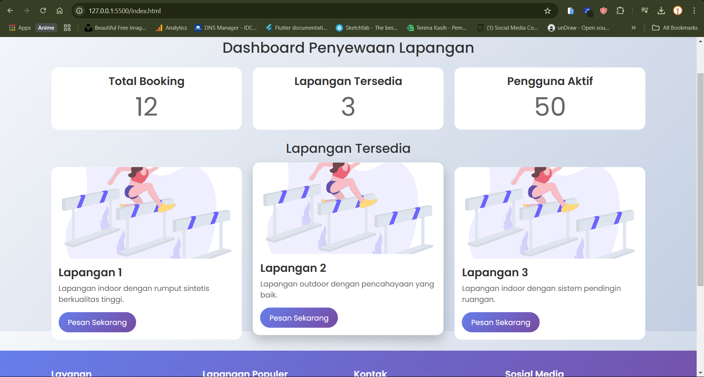
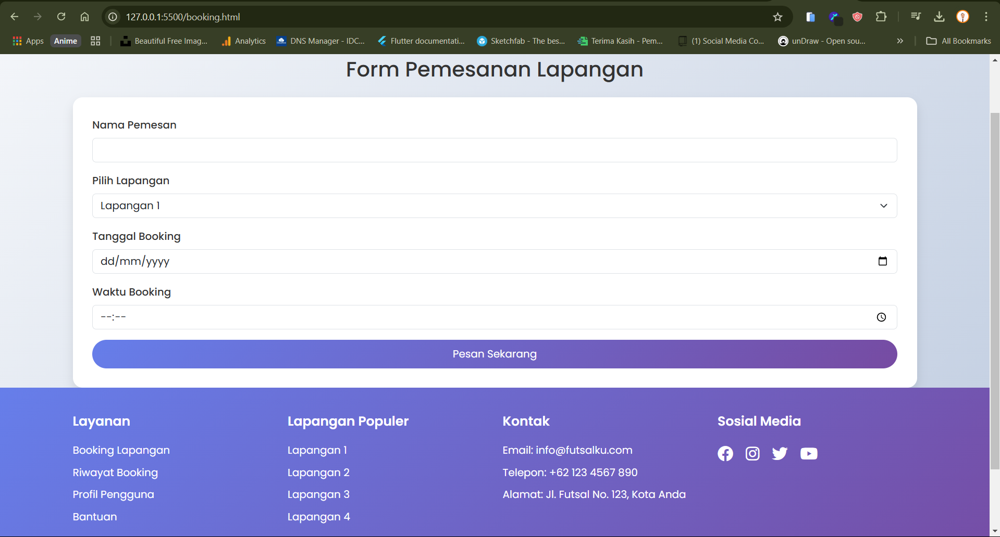

# Sistem Penyewaan Lapangan Futsal



Sistem penyewaan lapangan futsal berbasis web dengan antarmuka modern dan responsif. Proyek ini dirancang untuk memudahkan pengguna dalam memesan lapangan futsal dan admin dalam mengelola data lapangan, booking, dan laporan.

## Fitur

### Untuk Customer
- **Dashboard**: Melihat lapangan tersedia dan statistik booking.
- **Booking**: Memesan lapangan dengan memilih tanggal dan waktu.
- **Profil**: Mengelola informasi pribadi.
- **Riwayat**: Melihat riwayat booking.

### Untuk Admin
- **Dashboard**: Melihat statistik total booking, lapangan tersedia, pengguna aktif, dan pendapatan.
- **Manajemen Lapangan**: Menambah, mengedit, dan menghapus lapangan.
- **Manajemen Booking**: Melihat dan mengelola booking.
- **Laporan**: Melihat laporan pendapatan bulanan.

## Teknologi yang Digunakan
- **HTML5**: Struktur dasar website.
- **CSS3**: Styling dan animasi.
- **Bootstrap 5**: Framework CSS untuk desain responsif.
- **JavaScript**: Interaktivitas dan validasi form.
- **Chart.js**: Membuat grafik laporan.

## Screenshot

### Dashboard Customer


### Dashboard Admin


### Halaman Booking


## Cara Menjalankan Proyek

1. Clone repository ini:
   ```bash
   git clone https://github.com/caspertrack69/futsal-booking-system.git